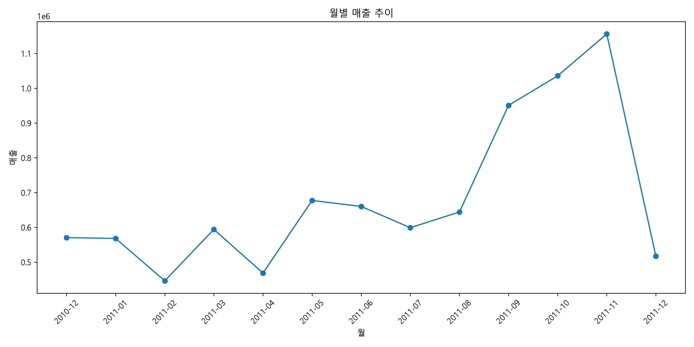
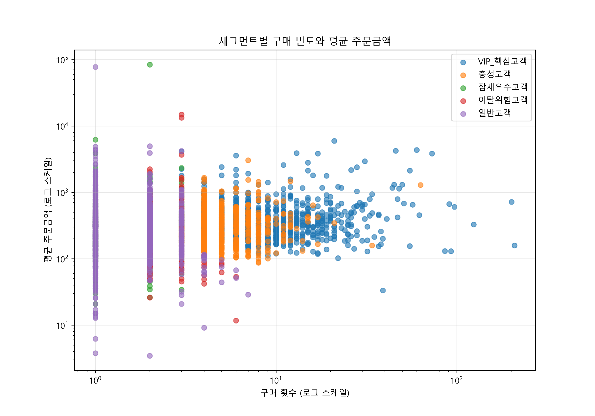
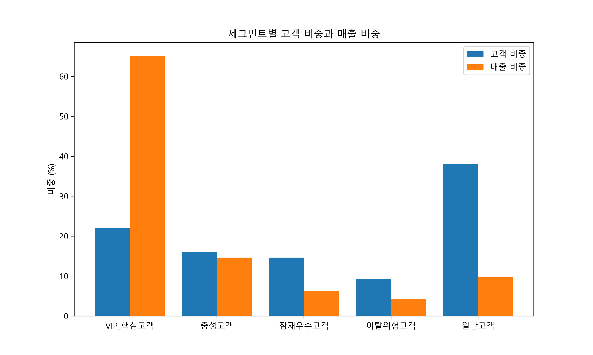
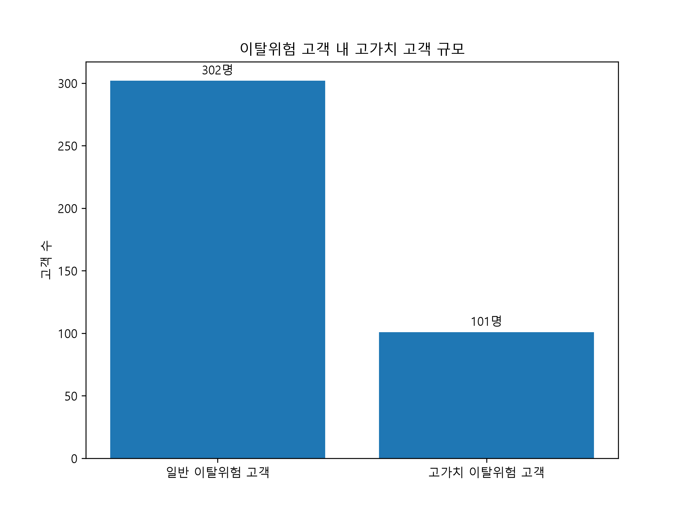
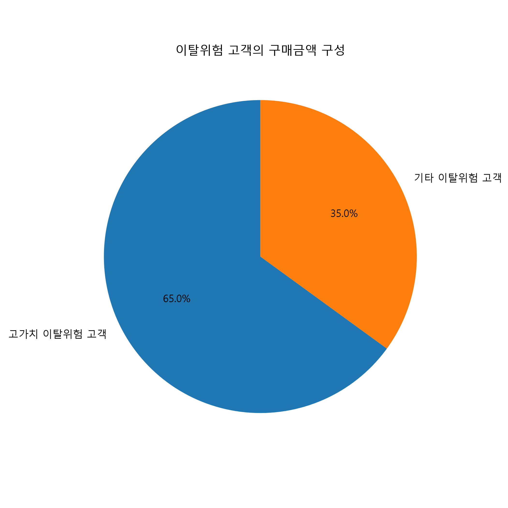

# 온라인 소매 고객 구매행동 분석 및 고객 세분화

> **온라인 소매 고객의 구매행동을 분석하여 고객군을 세분화하고,  
> 각 고객군에 적합한 데이터 기반 마케팅 전략을 도출하는 프로젝트**

---

## 📌 프로젝트 개요

### 프로젝트 목적

온라인 소매 거래 데이터를 활용하여 고객의 구매행동을 분석하고,
RFM 기반 고객 세분화를 통해 고객군별 특성을 파악한다.

이후 세그먼트별 상품 선호도와 구매가치를 분석하여
고객군별 차별화된 마케팅 전략을 제안하는 것을 목적으로 한다.

### 핵심 질문

> **"온라인 소매 고객의 구매행동을 분석하여 고객군을 세분화하고,
> 각 고객군에 적합한 마케팅 전략을 도출할 수 있는가?"**

### 프로젝트 기간

2010년 12월 ~ 2011년 12월 9일 데이터 분석

### 데이터

- **Dataset:** UCI Online Retail
- **분석 대상:** 고객 4,338명
- **주문 수:** 18,532건
- **분석 거래 데이터:** 392,692건

### 주요 분석

- 데이터 정제 및 전처리
- 전체 구매 규모 및 월별 매출 분석
- 고객별 구매행동 분석
- RFM 분석
- 고객 세그먼트 분류
- 세그먼트별 상품 선호도 분석
- 고가치 이탈위험 고객 분석
- 세그먼트별 마케팅 전략 도출

### 주요 결과

- VIP 핵심고객 **957명 (22.06%)**
- VIP 핵심고객 구매금액 비중 **65.17%**
- 이탈위험고객 **403명**
- 고가치 이탈위험고객 **101명**
- 고가치 이탈위험고객의 이탈위험 매출 비중 **64.99%**

---

## 🛠 Tech Stack

### Language
- Python

### Data Analysis
- Pandas
- NumPy
- SciPy

### Visualization
- Matplotlib
- Seaborn

### Analysis
- RFM Analysis
- Customer Segmentation
- Customer Penetration
- Preference Index

### Development
- VS Code
- Git
- GitHub

---

## 📑 목차

- [1. 데이터 전처리](#1-데이터-전처리)
- [2. 전체 구매 규모 분석](#2-전체-구매-규모-분석)
- [3. 월별 매출 추이 분석](#3-월별-매출-추이-분석)
- [4. 고객별 구매행동 분석](#4-고객별-구매행동-분석)
- [5. RFM 기반 고객 세분화](#5-rfm-기반-고객-세분화)
- [6. 세그먼트별 분석 결과](#6-세그먼트별-분석-결과)
- [7. 세그먼트별 상품 선호도 분석](#7-세그먼트별-상품-선호도-분석)
- [8. 고가치 이탈위험 고객 분석](#8-고가치-이탈위험-고객-분석)
- [9. 세그먼트별 마케팅 전략](#9-세그먼트별-마케팅-전략)
- [10. 프로젝트 핵심 KPI](#10-프로젝트-핵심-kpi)
- [11. 최종 핵심 인사이트](#11-최종-핵심-인사이트)
- [12. 한계 및 향후 발전 방향](#12-한계-및-향후-발전-방향)
- [13. 결론](#13-결론)

---

## 📁 프로젝트 구조

```text
marketing-consumer-analysis/
│
├── data/
│   └── Online Retail.xlsx
│
├── images/
│   ├── rfm.png
│   ├── segment_share.png
│   ├── high_value_at_risk_customer.png
│   ├── high_value_at_risk_sales.png
│   └── monthly_sales.png
│
├── notebooks/
│   └── 01_data_check.py
│
├── report/
│
├── .gitignore
└── README.md
```

---

## 🚀 실행 방법

### 1. 저장소 클론

```bash
git clone [GitHub 저장소 주소]
cd marketing-consumer-analysis
```

---

# 🔎 Analysis Process

## 1. 데이터 전처리

UCI Online Retail 데이터를 불러온 후
고객 구매행동 분석에 적합한 데이터셋을 구축하기 위해
결측치, 취소 거래, 음수 수량 및 비정상적인 가격 데이터를 확인하였다.

### 원본 데이터

- 전체 거래 데이터: **541,909건**
- 변수: **8개**
- 고객 수: CustomerID 기준 분석
- 분석 기간: **2010-12-01 ~ 2011-12-09**

### 데이터 품질 확인

주요 데이터 문제를 확인한 결과 다음과 같은 특징이 존재하였다.

- CustomerID 결측치 존재
- 상품 설명(Description) 결측치 존재
- 취소 거래 존재
- 음수 Quantity 존재
- 0 이하의 UnitPrice 존재
- 중복 거래 존재

### 분석 데이터 정의

고객 구매행동 분석에서는 다음 조건을 만족하는 거래를
정상 구매 데이터로 정의하였다.

- CustomerID가 존재하는 거래
- Quantity > 0
- UnitPrice > 0

이를 통해 고객 구매행동 분석에 적합한 거래 데이터를 구축하였다.

### 중복 데이터 처리

분석 기준에 맞는 거래를 추출한 이후
동일한 거래가 중복된 데이터를 제거하였다.

| 구분 | 데이터 건수 |
|---|---:|
| 원본 데이터 | 541,909건 |
| 분석 기준 적용 후 | 397,884건 |
| 중복 제거 후 | **392,692건** |

최종적으로 **392,692건의 거래 데이터**를
고객 구매행동 및 RFM 분석에 활용하였다.

또한 대량 구매 등 실제 거래일 가능성이 있는 극단값은
단순히 이상치로 판단하여 삭제하지 않고 별도로 검토하였다.

---

## 2. 전체 구매 규모 분석

전처리된 데이터를 기반으로 전체적인 고객 및 주문 규모를 확인하였다.

| 지표 | 결과 |
|---|---:|
| 분석 기간 | 2010-12-01 ~ 2011-12-09 |
| 고객 수 | 4,338명 |
| 주문 수 | 18,532건 |
| 총 구매금액 | 8,887,208.89 |
| 분석 국가 수 | 37개국 |

고객 4,338명이 총 18,532건의 주문을 발생시켰으며,
전체 구매금액은 약 888만으로 나타났다.

이를 통해 이후 고객별 구매행동 및 세그먼트 분석을 위한
전체적인 데이터 규모를 파악하였다.

---

## 3. 월별 매출 추이 분석

월별 구매금액을 집계하여 분석 기간 동안의 매출 변화를 확인하였다.



### 주요 결과

- 2011년 2월에는 약 **446,084.92**의 매출을 기록하였다.
- 이후 월별 등락은 존재하지만 전반적으로 증가하는 흐름이 나타났다.
- 특히 **2011년 9월부터 11월까지 매출이 크게 증가**하였다.
- 2011년 11월에는 **1,156,205.61**로 분석기간 중 가장 높은 월 매출을 기록하였다.
- 2011년 12월 데이터는 **12월 9일까지의 부분 데이터**이므로 월간 매출 감소로 해석하지 않았다.

이를 통해 전체적인 매출 규모뿐만 아니라
시간에 따른 구매활동의 변화도 확인하였다.

---

## 4. 고객별 구매행동 분석

고객별 구매행동을 파악하기 위해 고객 단위로 다음 지표를 산출하였다.

- **Recency**: 최근 구매 이후 경과일
- **Frequency**: 구매 횟수
- **Monetary**: 총 구매금액
- **Average Order Value**: 주문당 평균 구매금액

고객별 구매행동을 분석한 결과 고객 간 구매 규모와 구매 빈도에
큰 차이가 존재하는 것으로 나타났다.

일부 고객은 매우 높은 구매금액을 기록하는 반면,
일회성 또는 낮은 빈도로 구매하는 고객도 다수 존재하였다.

특히 고객별 구매금액의 평균과 중앙값 사이에 차이가 나타나
일부 고액 구매 고객이 평균값에 영향을 미치는 것으로 확인하였다.

따라서 단순한 전체 평균만으로 고객의 특성을 판단하기보다
고객별 구매행동을 기준으로 세분화할 필요가 있다고 판단하였다.

---

## 5. RFM 기반 고객 세분화

고객별 구매행동의 차이를 보다 체계적으로 파악하기 위해
RFM 분석을 수행하였다.

### RFM 분석 기준

| 지표 | 의미 | 해석 |
|---|---|---|
| Recency | 최근 구매 이후 경과일 | 낮을수록 최근 구매 |
| Frequency | 구매 횟수 | 높을수록 반복 구매 |
| Monetary | 총 구매금액 | 높을수록 높은 구매가치 |

각 지표를 5분위 기준으로 점수화하여 고객의 상대적인 구매행동을 비교하였다.

Recency는 최근 구매 고객이 높은 점수를 갖도록 역방향으로 점수화하였으며,
Frequency와 Monetary는 값이 높을수록 높은 점수를 부여하였다.



### RFM 기반 세그먼트

RFM 점수를 기반으로 고객을 다음 5개 그룹으로 분류하였다.

| 세그먼트 | 주요 특징 |
|---|---|
| VIP 핵심고객 | 최근 구매가 활발하고 구매빈도와 구매금액이 높음 |
| 충성고객 | 반복구매가 형성되어 있으며 구매가치가 높음 |
| 잠재우수고객 | 최근 구매했지만 구매빈도가 낮음 |
| 이탈위험고객 | 장기간 구매가 없으며 과거 구매 경험이 있음 |
| 일반고객 | 구매빈도와 구매금액이 상대적으로 낮음 |

---

## 6. 세그먼트별 분석 결과

RFM 분석을 통해 분류한 5개 고객 세그먼트의 규모와 구매금액을 비교하였다.

### 세그먼트별 고객 규모

| 세그먼트 | 고객 수 | 고객 비중 |
|---|---:|---:|
| 일반고객 | 1,652명 | 38.08% |
| VIP 핵심고객 | 957명 | 22.06% |
| 충성고객 | 693명 | 15.98% |
| 잠재우수고객 | 633명 | 14.59% |
| 이탈위험고객 | 403명 | 9.29% |
| **전체** | **4,338명** | **100%** |



일반고객이 전체 고객의 **38.08%**로 가장 큰 비중을 차지하였다.

반면 VIP 핵심고객은 전체 고객의 **22.06%**를 차지하여
전체 고객 중 약 5분의 1 수준으로 나타났다.

### 세그먼트별 구매행동

| 세그먼트 | 평균 Recency | 평균 Frequency | 평균 Monetary | 구매금액 비중 |
|---|---:|---:|---:|---:|
| VIP 핵심고객 | 11.82일 | 11.12회 | 6,051.87 | 65.17% |
| 충성고객 | 70.80일 | 5.19회 | 1,873.69 | 14.61% |
| 잠재우수고객 | 16.43일 | 1.79회 | 881.46 | 6.28% |
| 이탈위험고객 | 163.49일 | 2.41회 | 936.76 | 4.25% |
| 일반고객 | 157.64일 | 1.33회 | 521.56 | 9.70% |

분석 결과 **VIP 핵심고객은 전체 고객의 22.06%이지만
전체 구매금액의 65.17%를 차지**하는 것으로 나타났다.

이는 고객 수와 매출 기여도가 반드시 비례하지 않으며,
일부 고객군의 구매가 전체 매출에서 큰 비중을 차지하고 있음을 보여준다.

반면 일반고객은 전체 고객의 38.08%로 가장 큰 고객군이지만
구매금액 비중은 9.70%로 나타났다.

또한 잠재우수고객은 평균 Recency가 **16.43일**로 최근 구매가 이루어진 반면,
평균 Frequency는 **1.79회**로 상대적으로 낮게 나타났다.

따라서 최근 구매활동은 존재하지만 아직 반복구매가 충분히 형성되지 않은
고객군으로 볼 수 있다.

이탈위험고객은 평균 Recency가 **163.49일**로 다른 주요 고객군보다
최근 구매 이후 경과기간이 길게 나타났다.

이러한 결과를 바탕으로 각 고객군에 서로 다른 마케팅 목적과 전략을
적용할 필요가 있다고 판단하였다.

---


## 7. 세그먼트별 상품 선호도 분석

고객 세그먼트별로 구매한 상품을 비교하여
각 고객군이 어떤 상품에 상대적으로 높은 관심을 보이는지 분석하였다.

단순 판매량만 비교할 경우 특정 고객의 대량 구매가 결과에 영향을 줄 수 있기 때문에,
상품별 **구매 고객 수(CustomerCount)**와 세그먼트 내 **고객 침투율(CustomerPenetration)**을 활용하였다.

또한 `POSTAGE`, `Manual`과 같이 일반적인 상품 구매로 보기 어려운 거래는
상품 선호도 분석에서 제외하였다.

### 상품 선호도 분석 기준

- **CustomerCount**: 해당 상품을 구매한 고객 수
- **CustomerPenetration**: 해당 세그먼트 고객 중 해당 상품을 구매한 비율
- **PreferenceIndex**: 전체 고객 대비 특정 세그먼트에서 해당 상품이 얼마나 상대적으로 많이 구매되었는지를 나타내는 지표

Preference Index는 다음과 같이 계산하였다.

> **Preference Index = 세그먼트 상품 구매 침투율 ÷ 전체 고객 상품 구매 침투율**

Preference Index가 1보다 크면 전체 고객에 비해 해당 세그먼트에서
상대적으로 높은 구매 비중을 보이는 상품으로 해석할 수 있다.

### 세그먼트별 주요 선호 상품

#### VIP 핵심고객

VIP 핵심고객에서는 다음과 같은 상품이 상대적으로 높은 선호도를 보였다.

| 상품 | 구매 고객 수 | Preference Index |
|---|---:|---:|
| PAPER BUNTING VINTAGE PARTY | 35 | 3.97 |
| LUNCH BAG RED VINTAGE DOILY | 91 | 3.93 |
| OVAL MINI PORTRAIT FRAME | 30 | 3.40 |
| CLASSIC BICYCLE CLIPS | 57 | 3.36 |
| BICYCLE PUNCTURE REPAIR KIT | 68 | 3.31 |

VIP 핵심고객은 구매 빈도와 구매금액이 높은 고객군이므로
이들의 상대적 상품 선호도를 활용하여 신규 상품이나 관련 상품을 추천하는
교차판매 전략에 활용할 수 있다.

#### 충성고객

충성고객에서는 다음과 같은 상품이 상대적으로 높은 선호도를 보였다.

| 상품 | 구매 고객 수 | Preference Index |
|---|---:|---:|
| DINOSAUR KEYRINGS ASSORTED | 35 | 2.11 |
| SLEEPING CAT ERASERS | 36 | 2.07 |
| PANTRY PASTRY BRUSH | 37 | 1.93 |

충성고객은 반복구매가 형성된 고객군이므로
기존 구매상품과 연관성이 높은 상품을 함께 추천하는 방식으로
추가 구매를 유도할 수 있다.

#### 잠재우수고객

잠재우수고객에서는 다음과 같은 상품이 상대적으로 높은 선호도를 보였다.

| 상품 | 구매 고객 수 | Preference Index |
|---|---:|---:|
| TRADITIONAL PICK UP STICKS GAME | 55 | 1.86 |
| TRADITIONAL ALPHABET STAMP SET | 41 | 1.85 |
| VINTAGE DOILY DELUXE SEWING KIT | 37 | 1.75 |
| FAIRY CAKE FLANNEL ASSORTED COLOUR | 36 | 1.54 |

잠재우수고객은 최근 구매가 이루어졌지만 구매 빈도가 낮은 고객군이다.

따라서 최근 구매상품과 관련된 상품을 추천하거나
재구매 프로모션과 결합하여 두 번째 구매를 유도하는 전략을 고려할 수 있다.

#### 이탈위험고객

이탈위험고객에서는 다음과 같은 상품들이 상대적으로 높은 선호도를 보였다.

| 상품 | 구매 고객 수 | Preference Index |
|---|---:|---:|
| FRENCH LAVENDER SCENT HEART | 12 | 1.87 |
| LAVENDER SCENTED FABRIC HEART | 18 | 1.85 |
| FINE WICKER HEART | 22 | 1.56 |

이탈위험고객은 과거 구매 경험은 있지만 최근 구매 이후
오랜 기간이 경과한 고객군이다.

따라서 과거 구매상품과 관련된 상품을 활용하여
개인화된 재구매 메시지나 리마케팅에 활용할 수 있다.

### 상품 선호도 분석의 활용

세그먼트별 상품 선호도 분석을 통해 동일한 상품을 모든 고객에게
동일하게 추천하기보다 고객군별 구매행동과 상품 관심도를 고려한
차별화된 마케팅 전략을 설계할 수 있다.

특히 Preference Index는 절대적인 판매량이 아니라
**전체 고객 대비 특정 세그먼트의 상대적인 선호도**를 나타내므로,
고객 세그먼트별 상품 추천 및 캠페인 기획의 참고 지표로 활용하였다.

단, 구매 고객 수가 매우 적은 상품은 Preference Index가 높게 나타날 수 있으므로
해당 지표만으로 상품의 절대적인 인기나 수요를 판단하지 않았다.

---

## 8. 고가치 이탈위험 고객 분석

RFM 세그먼트 분석 결과 이탈위험고객은 전체 4,338명 중
403명으로 나타났다.

그러나 이탈위험고객이라고 하더라도 모든 고객의 구매가치가 동일한 것은 아니므로,
이탈위험고객 중에서도 구매금액이 높은 고객을 별도로 분석하였다.

### 고가치 이탈위험 고객 정의

이탈위험고객의 구매금액(Monetary)을 기준으로 3사분위수(Q3)를 계산하고,
Q3보다 높은 구매금액을 가진 고객을 **고가치 이탈위험 고객**으로 정의하였다.

이 기준을 적용한 결과:

| 구분 | 고객 수 | 구매금액 |
|---|---:|---:|
| 전체 이탈위험고객 | 403명 | 377,513.21 |
| 고가치 이탈위험고객 | 101명 | 245,346.61 |

고가치 이탈위험고객은 전체 이탈위험고객의 약 **25.1%**에 해당하지만,
이탈위험고객 전체 구매금액의 **64.99%**를 차지하였다.





이는 이탈위험고객을 단순히 하나의 고객군으로 관리하기보다
과거 구매가치가 높은 고객을 별도로 식별할 필요가 있음을 보여준다.

### 고가치 이탈위험 고객의 주요 구매상품

고가치 이탈위험 고객이 구매했던 상품을 분석하여
재구매 유도 및 리마케팅에 활용할 수 있는 주요 상품을 확인하였다.

| 상품 | 구매 고객 수 | 상품 구매금액 | 고객 침투율 |
|---|---:|---:|---:|
| REGENCY CAKESTAND 3 TIER | 30 | 1,915.35 | 29.70% |
| JAM MAKING SET WITH JARS | 29 | 1,107.75 | 28.71% |
| PARTY BUNTING | 26 | 2,091.35 | 25.74% |
| PACK OF 72 RETROSPOT CAKE CASES | 23 | 545.15 | 22.77% |
| WHITE HANGING HEART T-LIGHT HOLDER | 21 | 10,544.65 | 20.79% |
| SPOTTY BUNTING | 20 | 1,023.85 | 19.80% |
| SET OF 3 CAKE TINS PANTRY DESIGN | 20 | 731.70 | 19.80% |

고가치 이탈위험 고객이 과거에 구매했던 상품을 확인함으로써
단순한 일괄 할인보다는 고객의 과거 구매이력을 기반으로 한
개인화된 재구매 마케팅에 활용할 수 있다.

### 고가치 이탈위험 고객 분석의 의미

고가치 이탈위험 고객은 현재 구매활동이 감소하거나 중단된 상태이지만
과거 구매금액이 높은 고객이라는 특징을 가진다.

따라서 이 고객군에 대해서는 다음과 같은 방식의 마케팅 전략을 고려할 수 있다.

- 과거 구매상품 기반의 개인화 추천
- 관련 상품 및 대체 상품 추천
- 재구매 쿠폰 또는 프로모션 제공
- 장기 미구매 고객 대상 리마케팅
- 고객별 구매이력을 활용한 맞춤형 메시지 발송

이와 같이 고객의 **현재 활동성(Recency)**과
**과거 구매가치(Monetary)**를 함께 고려하면
단순한 고객 세분화를 넘어 마케팅 자원의 우선적인 활용 대상까지
구체적으로 정의할 수 있다.

---

## 9. 세그먼트별 마케팅 전략

RFM 기반 고객 세분화와 상품 선호도 분석 결과를 바탕으로
각 고객군의 구매행동에 적합한 마케팅 전략을 도출하였다.

고객군마다 구매 빈도와 최근 구매 시점, 구매금액이 다르기 때문에
모든 고객에게 동일한 마케팅 활동을 적용하기보다
세그먼트별 목적에 맞는 전략을 설정하였다.

### 세그먼트별 마케팅 전략

| 세그먼트 | 주요 특징 | 마케팅 목적 | 제안 전략 |
|---|---|---|---|
| VIP 핵심고객 | 최근 구매가 활발하고 구매빈도와 구매금액이 높음 | 고객 유지 | VIP 혜택, 신상품 및 관련 상품 추천 |
| 충성고객 | 반복구매가 형성되어 있고 구매가치가 높음 | 고객가치 확대 | 연관상품 추천, 교차판매 |
| 잠재우수고객 | 최근 구매했지만 구매빈도가 낮음 | 반복구매 유도 | 재구매 프로모션, 관련 상품 추천 |
| 이탈위험고객 | 최근 구매 이후 장기간 경과 | 고객 재활성화 | 리마케팅, 재구매 쿠폰 |
| 일반고객 | 구매빈도와 구매금액이 상대적으로 낮음 | 구매 활성화 | 인기상품 추천, 저비용 CRM |
| 고가치 이탈위험고객 | 이탈위험고객 중 과거 구매가치가 높음 | 우선 재활성화 | 과거 구매 기반 개인화 리마케팅 |

### 9-1. VIP 핵심고객

VIP 핵심고객은 전체 고객의 22.06%이지만
전체 구매금액의 65.17%를 차지하는 고객군이다.

따라서 신규 고객 확보보다 기존 고객의 지속적인 구매활동을
유지하는 것이 중요한 고객군으로 볼 수 있다.

주요 전략은 다음과 같다.

- VIP 고객 대상 혜택 제공
- 신상품 및 신규 카테고리 추천
- 기존 구매상품과 연관된 상품 추천
- 구매주기에 따른 개인화 프로모션

특히 세그먼트별 상품 선호도 분석 결과를 활용하여
일반적인 인기상품이 아닌 VIP 고객군에서 상대적으로 높은 선호도를
보이는 상품을 추천할 수 있다.

### 9-2. 충성고객

충성고객은 반복구매가 형성되어 있으며
평균 구매빈도와 구매금액이 상대적으로 높은 고객군이다.

따라서 기존 구매행동을 유지하면서 추가적인 구매를 유도하는
교차판매 전략을 적용할 수 있다.

- 기존 구매상품과 연관된 상품 추천
- 함께 구매되는 상품 조합 제안
- 구매 카테고리 확장 유도
- 반복구매 고객 대상 프로모션

### 9-3. 잠재우수고객

잠재우수고객은 평균 Recency가 16.43일로 최근 구매활동이 존재하지만
평균 Frequency가 1.79회로 아직 반복구매가 충분히 형성되지 않은 고객군이다.

따라서 첫 구매 이후 두 번째 구매를 유도하는 전략이 중요하다.

- 첫 구매상품과 관련된 상품 추천
- 재구매 쿠폰 제공
- 일정 기간 내 재구매 프로모션
- 최근 구매상품 기반 개인화 메시지

이 고객군이 반복구매 고객으로 전환될 경우
향후 고객가치를 확대할 수 있는 가능성을 확인할 수 있다.

### 9-4. 이탈위험고객

이탈위험고객은 평균 Recency가 163.49일로
최근 구매 이후 상당한 기간이 경과한 고객군이다.

따라서 신규 고객을 대상으로 하는 마케팅보다
기존 구매이력을 활용한 재활성화 전략을 적용할 수 있다.

- 과거 구매상품 기반 리마케팅
- 재구매 쿠폰 및 프로모션
- 과거 관심상품과 유사한 상품 추천
- 장기 미구매 고객 대상 CRM 캠페인

특히 고객별 과거 구매상품을 활용하면
동일한 메시지를 모든 이탈위험고객에게 보내는 방식보다
고객별 구매이력에 맞춘 마케팅 활동을 설계할 수 있다.

### 9-5. 일반고객

일반고객은 전체 고객의 38.08%로 가장 큰 고객군이지만
구매금액 비중은 9.70%로 나타났다.

따라서 개별 고객에게 높은 비용을 투입하기보다는
상대적으로 비용 효율적인 방식으로 구매활동을 유도하는 전략을 고려할 수 있다.

- 인기상품 및 베스트셀러 추천
- 저비용 이메일 또는 CRM 캠페인
- 구매금액에 따른 할인 프로모션
- 관심상품 기반 상품 추천

### 9-6. 고가치 이탈위험고객

고가치 이탈위험고객은 이탈위험고객 403명 중
101명으로 확인되었으며,
이들이 이탈위험고객 전체 구매금액의 64.99%를 차지하였다.

따라서 이 고객군은 일반적인 이탈위험고객과 구분하여
별도의 재활성화 전략을 적용하는 방안을 고려할 수 있다.

특히 과거 구매금액과 구매상품 정보를 함께 활용하여
고객별로 차별화된 리마케팅을 설계할 수 있다.

예를 들어:

> 과거 구매상품 확인  
> ↓  
> 관련 상품 선정  
> ↓  
> 개인화 추천 메시지 발송  
> ↓  
> 재구매 프로모션 제공  
> ↓  
> 재구매 여부 및 구매금액 측정

이러한 방식으로 고객 세분화 결과를 실제 CRM 활동과 연결할 수 있다.

### 세그먼트별 전략의 핵심

본 분석에서는 고객을 단순히 구매금액이나 구매횟수 하나만으로
구분하지 않고 **최근 구매시점(Recency), 구매빈도(Frequency),
구매금액(Monetary)**을 함께 고려하였다.

이를 통해 고객군별로

**유지 → 확대 → 전환 → 재활성화 → 구매 활성화**

라는 서로 다른 마케팅 목적을 설정하였다.

또한 상품 선호도와 과거 구매이력을 함께 활용함으로써
고객 세그먼트와 상품 추천을 연결하는 데이터 기반 마케팅 전략을
구성하였다.

---

## 10. 프로젝트 핵심 KPI

본 분석에서 도출된 주요 지표를 정리하면 다음과 같다.

| KPI | 결과 |
|---|---:|
| 전체 고객 수 | 4,338명 |
| 전체 주문 수 | 18,532건 |
| 전체 구매금액 | 8,887,208.89 |
| VIP 핵심고객 비중 | 22.06% |
| VIP 핵심고객 구매금액 비중 | 65.17% |
| 잠재우수고객 수 | 633명 |
| 이탈위험고객 수 | 403명 |
| 고가치 이탈위험고객 수 | 101명 |
| 고가치 이탈위험고객의 이탈위험 매출 비중 | 64.99% |

### 핵심 지표 해석

분석 결과 전체 고객 **4,338명**을 대상으로
총 **18,532건의 주문**과 약 **888만**의 구매금액이 발생하였다.

특히 VIP 핵심고객은 전체 고객의 **22.06%**에 해당하지만
전체 구매금액의 **65.17%**를 차지하였다.

또한 이탈위험고객 403명 가운데 고가치 이탈위험고객은
101명으로 나타났으며, 이들이 이탈위험고객 전체 구매금액의
**64.99%**를 차지하였다.

이를 통해 고객 수 자체보다 **고객군별 구매가치와 이탈 가능성을
함께 고려하는 것이 중요함**을 확인하였다.

---

## 11. 최종 핵심 인사이트

본 프로젝트에서는 온라인 소매 거래 데이터를 활용하여
고객의 구매행동을 분석하고 RFM 기반으로 고객을 세분화하였다.

분석 결과 다음과 같은 핵심 인사이트를 도출하였다.

### 1. 소수의 고객군이 전체 구매금액에서 높은 비중을 차지

VIP 핵심고객은 전체 고객의 **22.06%**이지만
전체 구매금액의 **65.17%**를 차지하였다.

이는 고객 수와 매출 기여도가 동일하게 나타나지 않으며,
고객의 구매가치를 기준으로 관리하는 것이 필요함을 보여준다.

### 2. 일반고객은 고객 수가 많지만 구매금액 비중은 상대적으로 낮음

일반고객은 전체 고객의 **38.08%**로 가장 큰 고객군이지만
전체 구매금액에서 차지하는 비중은 **9.70%**로 나타났다.

따라서 일반고객에게는 높은 비용의 개별 마케팅보다는
인기상품 추천이나 CRM 등 상대적으로 비용 효율적인
구매 활성화 전략을 적용할 수 있다.

### 3. 잠재우수고객은 최근 구매활동과 낮은 구매빈도가 동시에 나타남

잠재우수고객의 평균 Recency는 **16.43일**로 최근 구매활동이 존재했지만,
평균 Frequency는 **1.79회**로 반복구매 수준은 상대적으로 낮았다.

따라서 첫 구매 이후 두 번째 구매를 유도하는
재구매 프로모션이나 관련 상품 추천 전략을 적용할 수 있다.

### 4. 고가치 이탈위험 고객을 별도로 관리할 필요가 있음

전체 이탈위험고객은 **403명**이었으며,
이 가운데 **101명**을 고가치 이탈위험 고객으로 정의하였다.

이 101명은 이탈위험고객 전체 구매금액의 **64.99%**를 차지하였다.

따라서 이탈위험고객을 동일하게 관리하기보다
과거 구매금액과 구매이력을 함께 고려하여
고가치 고객을 별도로 식별하고 재활성화 전략을 적용할 수 있다.

### 종합

본 프로젝트를 통해 단순히 고객을 구매금액이나 구매횟수로
분류하는 것이 아니라,

**구매 데이터 → 고객 행동 분석 → RFM 세분화 → 상품 선호도 분석
→ 고가치 고객 식별 → 마케팅 전략 도출**

의 분석 과정을 구축하였다.

이를 통해 데이터 분석 결과를 실제 고객 관리와 마케팅 의사결정에
활용할 수 있는 방향을 제시하였다.

---

## 12. 한계 및 향후 발전 방향

본 프로젝트는 온라인 소매 거래 데이터를 기반으로 고객의 구매행동을
분석하고 고객 세그먼트별 마케팅 전략을 도출하였다.

다만 분석 데이터와 방법론의 특성상 다음과 같은 한계가 존재한다.

### 12-1. RFM 기준의 한계

본 프로젝트에서는 Recency, Frequency, Monetary를 5분위 기준으로
점수화하여 고객을 세분화하였다.

그러나 분위수 기반 점수는 데이터 내 고객의 상대적인 위치를 나타내는
방법이므로 절대적인 고객가치를 의미하지는 않는다.

또한 RFM 점수를 합산하는 과정에서 서로 다른 구매행동을 가진 고객이
동일한 점수를 가질 가능성이 있다.

향후에는 RFM 점수뿐만 아니라 고객의 구매주기, 평균 구매금액,
구매상품 다양성 등의 변수를 추가하여 고객 세분화를 고도화할 수 있다.

### 12-2. 데이터 기간의 한계

분석 데이터는 **2010년 12월부터 2011년 12월 9일까지**의 거래 데이터로,
현재의 소비시장이나 고객 행동을 직접적으로 대표한다고 보기는 어렵다.

따라서 실제 기업 데이터에 적용할 경우 최근 데이터를 활용하여
고객 세그먼트와 구매행동의 변화를 지속적으로 모니터링할 필요가 있다.

### 12-3. 인과관계 분석의 한계

본 프로젝트에서는 거래 데이터를 기반으로 고객의 구매행동과
세그먼트별 특성을 분석하였다.

그러나 특정 마케팅 활동이 실제 구매 증가를 발생시켰는지와 같은
인과관계까지 직접적으로 검증하지는 않았다.

향후에는 고객군별 프로모션에 대한 실험군과 대조군을 구성하고
A/B 테스트를 수행하여 마케팅 활동의 실제 효과를 검증할 수 있다.

### 12-4. 상품 추천 모델로의 확장

본 프로젝트에서는 세그먼트별 상품 선호도와 Preference Index를 활용하여
상품 추천 방향을 제시하였다.

향후에는 고객별 구매이력을 활용하여 추천 시스템으로 확장할 수 있다.

예를 들어 다음과 같은 분석을 추가할 수 있다.

- 고객-상품 구매행렬 구축
- 상품 간 동시구매 분석
- 연관규칙 분석
- 협업 필터링
- 상품 추천 모델 구축

이를 통해 현재의 **고객 세분화 → 마케팅 전략** 분석을
**고객 세분화 → 개인화 추천 → 마케팅 성과 측정**의 형태로 확장할 수 있다.

### 12-5. 마케팅 성과 측정으로의 확장

현재 프로젝트에서는 데이터 분석 결과를 기반으로
마케팅 전략을 제안하는 단계까지 수행하였다.

향후 실제 캠페인 데이터를 확보할 경우 다음과 같은 KPI를 추가하여
마케팅 전략의 효과를 정량적으로 측정할 수 있다.

- 재구매율
- 고객 유지율
- 평균 주문금액(AOV)
- 고객 생애가치(CLV)
- 캠페인 전환율
- 캠페인 ROI

이를 통해 단순한 고객 분석을 넘어
**데이터 기반 마케팅 의사결정 및 성과 측정 체계**로 발전시킬 수 있다.

---

## 13. 결론

본 프로젝트에서는 UCI Online Retail 데이터를 활용하여
온라인 소매 고객의 구매행동을 분석하고,
RFM 기반 고객 세분화와 상품 선호도 분석을 수행하였다.

분석 결과 고객별 구매행동에는 큰 차이가 존재했으며,
특히 VIP 핵심고객은 전체 고객의 **22.06%**에 불과하지만
전체 구매금액의 **65.17%**를 차지하는 것으로 나타났다.

또한 이탈위험고객을 추가적으로 분석하여
전체 403명의 이탈위험고객 중 **101명의 고가치 이탈위험고객**을
식별하였으며, 이들이 이탈위험고객 전체 구매금액의
**64.99%**를 차지하는 것을 확인하였다.

이를 통해 고객의 규모만 파악하는 것이 아니라
**고객의 구매가치와 최근 구매활동을 함께 고려하여
고객을 세분화하는 것이 중요함**을 확인하였다.

또한 세그먼트별 상품 선호도를 분석하여
고객군별 차별화된 상품 추천과 마케팅 전략을 제안하였다.

최종적으로 본 프로젝트는

**데이터 정제 → 구매행동 분석 → RFM 고객 세분화
→ 상품 선호도 분석 → 고가치 고객 식별
→ 세그먼트별 마케팅 전략 도출**

의 과정을 통해 거래 데이터를 실제 마케팅 의사결정에
활용할 수 있는 분석 구조를 구축하는 것을 목표로 하였다.

향후에는 고객 생애가치(CLV), 추천 시스템, A/B 테스트 및
마케팅 성과 측정 등을 추가하여
보다 정교한 데이터 기반 CRM 분석으로 확장할 수 있다.

---
